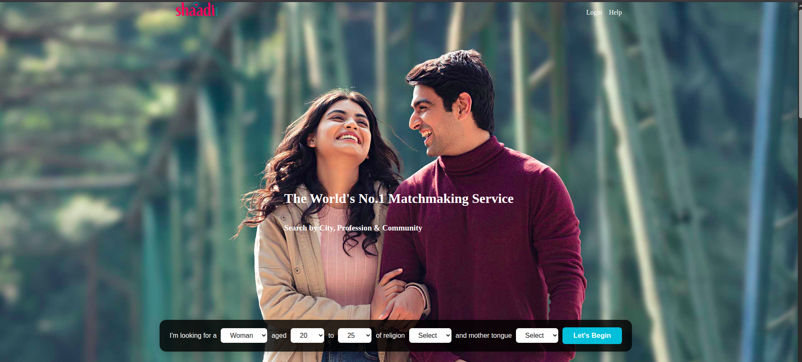

# 💍 Shaadi.com Clone

A static **Shaadi.com Clone** website built using **HTML** and **CSS**.  
This project replicates the look and feel of the popular matrimonial platform **Shaadi.com** and focuses on **frontend design** and **UI styling**.

---

## ✨ Features
- Responsive homepage design  
- Navigation bar with multiple links  
- Profile listing and matrimonial services section  
- Modern UI with clean layouts  
- Footer with contact details  

---

## 🛠️ Tech Stack
- **HTML5** – Structure of the website  
- **CSS3** – Styling, layout, and responsiveness  

---

## 📸 Screenshots
### Homepage
  

---

## 🚀 How to Run Locally
1. Clone the repository:
   ```bash
   git clone https://github.com/yourusername/shaadi-clone.git
   
2. Navigate to the project Folder:
   ```bash
   cd shaadi-clone
3. open index.html in your browser.

## 📂 Folder Structure
shaadi-clone/<br>
│── index.html<br>
│── style.css<br>
│── /images<br>
│── README.md

## 📌 Future Improvements

- Add JavaScript for interactivity (login/signup forms, sliders, etc.)
- Create backend with user authentication and database
- Deploy with a custom domain

## 🙌 Acknowledgements

This project is created for educational purposes only.
It is a frontend clone of Shaadi.com and is not affiliated with the official website.

## 👨‍💻 Author
Darpan YB<br>
mail: darpanbrahma@gmail.com

